# DEMO

---

## Part 1 — Blender Modelling Steps

### Step 1 — Base mesh: building the chair from separate box parts

The chair was constructed using 16 separate mesh objects (as opposed to a single mesh object) to be able to position and scale each part independently. Each of the parts was initially a cube mesh object that was scaled into a plank or post, and then positioned. All 16 parts are listed in the outliner on the right: four legs (Left/Right Leg Front and Back), two side and two cross rails (Left Leg Side, Right Leg Side), the seat along with its four side rails, and five back-rest parts (Back Rest Bottom, Top and three vertical slats). Expanding *Left Leg Front* will show its cube mesh object and the modifier stack.

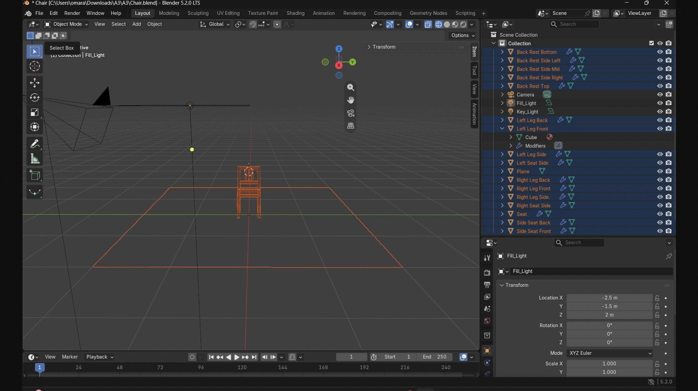
*Object Mode - the complete set of 16 parts for the chair in Blender outliner.*

### Step 2 — Scene assembly and lighting setup

The 16 parts were assembled to make the chair and the chair was placed onto the ground plane to have shadows in the final render. Two area lights were added to the scene for the render: **Key_Light** positioned at (2.5, -2.0, 3.0) with 500 W power for primary lighting and **Fill_Light** positioned at (-2.5, -1.5, 2.0) with 150 W and a slightly larger 3.0 size to soften shadows from the opposite side. Fill_Light transform properties are shown in the bottom-right panel.

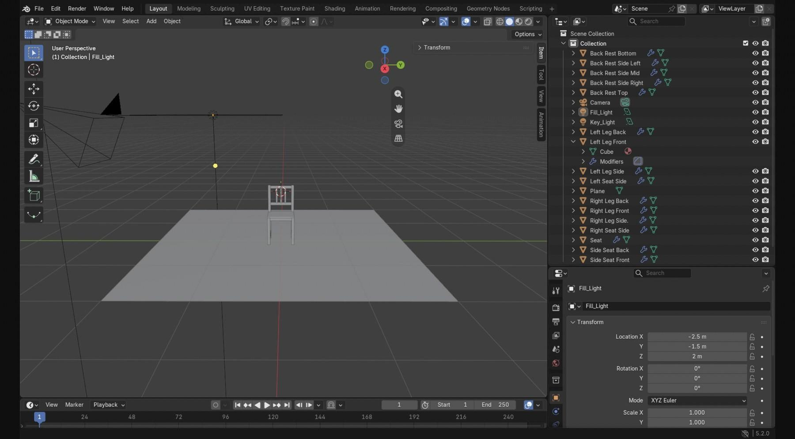
*Preview render in solid-shading mode with the assembled chair, ground plane and two area lights.*

### Step 3 — UV unwrapping

In order to apply any kind of texture, the first step was UV unwrapping in order to make sure the material adheres properly to the surface instead of simply covering the surface area with the texture. Since the chair consists of boxes, the intelligent cube projection creates a classic X-shaped UV mapping, as seen in the UV editor on the left hand side, where the six sides of the box are flattened out. All chair objects are selected in the outliner to make the unwrapping process consistent throughout the entire model.

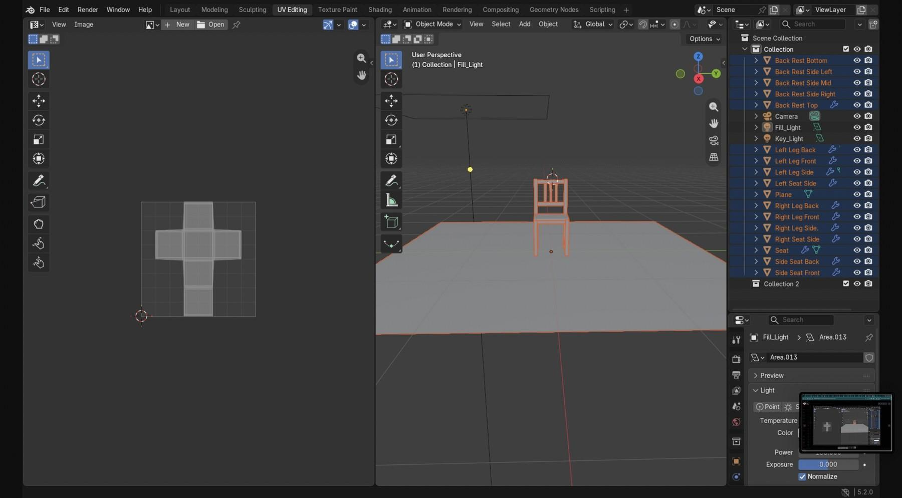
*UV editing workspace – the unwrapped box shape for all selected chair objects.*

### Step 4 — Texturing: procedural wood material

Rather than using an image texture, a procedural wood material was created through shader nodes and applied to all materials of the chair. First, a **Wave Texture** node in the Bands mode (scale 8.0, distortion 3.0) creates the wood grain texture, which is then connected to a Color **Ramp** node that creates the transition between dark brown and light brown color range. The colors from the color ramp drive the **Base** Color of a Principled BSDF, while the roughness is 0.4. The render shown below is the first out of the four taken in different camera angles around the chair.

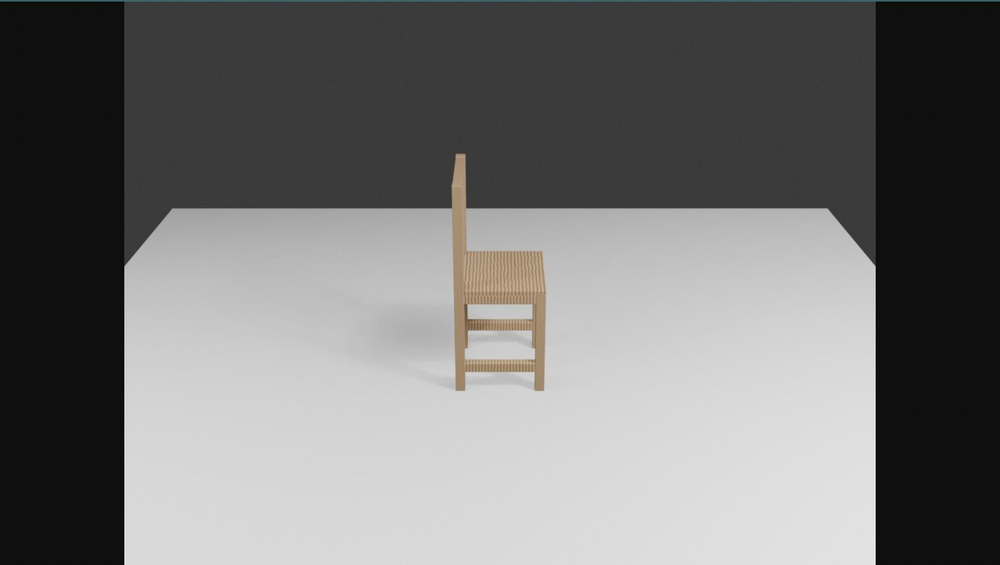
*Render 1 (camera angle 1) – side view, with the wood grain crossing the seat and rails of the chair.*

### Step 5 — Rendered views (2 of 4)

The four renders in the end were made by rotating the camera around the chair in 0, 90, 180 and 270 degree angles on a radius of 4.0 units, pointing the camera towards the level of the seat and rendering the scene in the resolution of 1280x960. Below is a back view of the three vertical slats of the back rest and the horizontal rail underneath, together with the shadow created by the key light source.

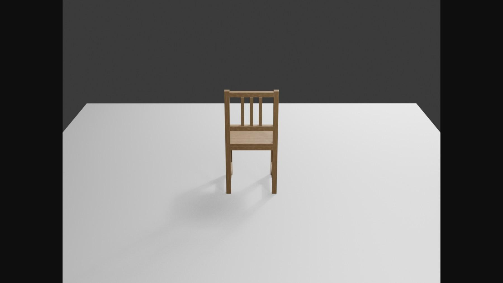
*Render 2 (camera angle 2) – demonstrating the back-rest slats and soft shadows cast by the key light.*

### Step 6 — Rendered views (3 of 4)

The opposing view of the chair. As the wave textures are calculated separately for each material used in the scene, and the chair consists of 16 individual material slots for each of its parts, there are slight differences in grain pattern and coloration of the chair's parts. In this view, two side rails connecting the front and back legs of the chair are clearly visible.

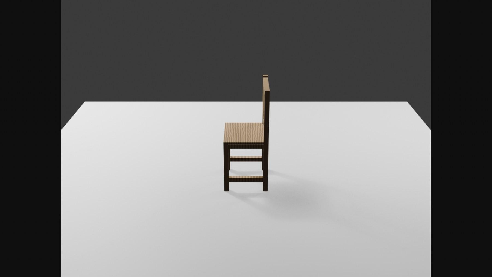
*Render 3 (camera angle 3) – the opposing view of the chair with side rail legs clearly visible.*

### Step 7 — Rendered views (4 of 4) and final result

The front view of the chair, as in the reference photo provided in the assignment sheet. It is the final result of the modelling work: 16 parts of the chair with procedurally calculated texture, two-point lighting (key and fill), and rendering on the ground plane. The chair was exported to **Chair.obj** (along with Chair.mtl file).

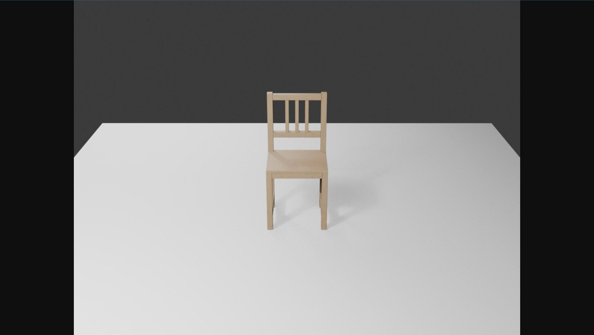
*Render 4 (camera angle 4) – front view of the final textured and lit chair.*

---

## Part 2 — OpenGL Output

### Step 1 — Testing the OBJ loader with a simple mesh

Before importing the chair, the developed OBJ loader was checked with the simplest model – a cube. The OBJ loader goes through a file line-by-line: the lines starting with 'v' represent vertex coordinates and the lines starting with 'f' correspond to face indices. As the OBJ face token is either v, v/vt or v/vt/vn, only the part of the token before the first slash is considered, and converted from the 1-based OBJ indices into 0-based OpenGL indices. The faces with more than three vertices are triangulated in a simple fan pattern. Thus, correct rendering of the cube has ensured that the loader, the VAO/VBO/EBO setup and shaders work correctly.

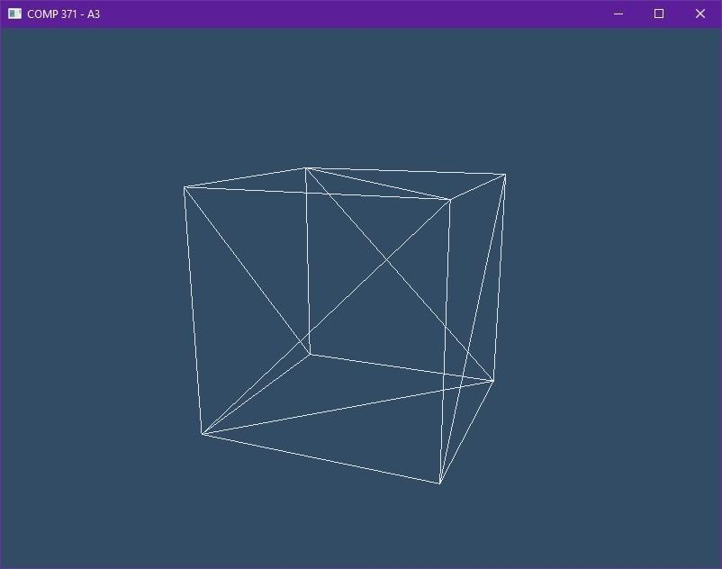
*The rendered cube.obj in wireframe mode, with glPolygonMode(GL_FRONT_AND_BACK, GL_LINE).*

### Step 2 — Chair.obj loaded and displayed

Importing of the chair is performed successfully: the total number of vertices is 896 and 1,728 triangles across 16 different parts. The Blender OBJ contains the continuous numbering of the vertices for all the objects, so the entire chair imports into one vertex buffer and one index buffer, and is rendered with one call to glDrawElements. At the time of importing, the program calculates the bounding box for the model and centers the chair at the origin, with the use of the biggest dimension for scaling to a certain size on the screen (which is independent of the Blender units).

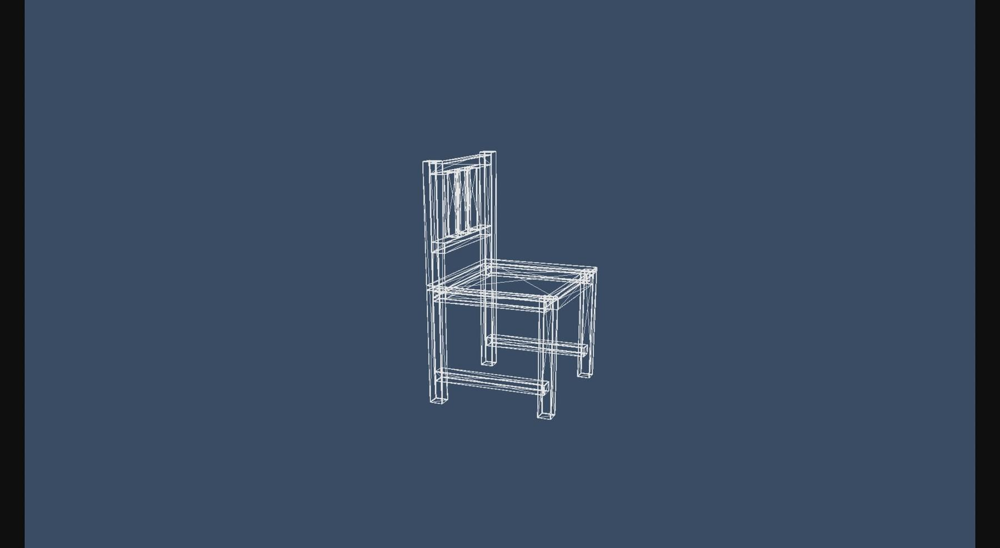
*The chair model in its default state.*

### Step 3 — Translation to the right (D key)

The translation is done by W, A, S, and D. Holding down one of these keys translates the model smoothly, as opposed to moving in fixed amounts, and the amount is scaled with the delta time for the frame to make sure that the chair moves at a constant speed, irrespective of the rendering speed of the computer. D has translated the chair along the positive x-axis, to the right of the screen.

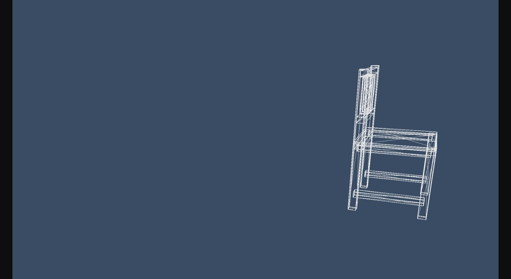
*Translation along +x axis using the D key.*

### Step 4 — Translation left and up (A and W keys)

The A key translates the model in the opposite direction along the x-axis, while the W key translates it along the positive y axis. Using both of these keys translates the model diagonally upwards towards the upper left corner of the screen. This is because the translation is done on the outside of the model matrix, which is why the chair is not affected by any rotation or scaling.

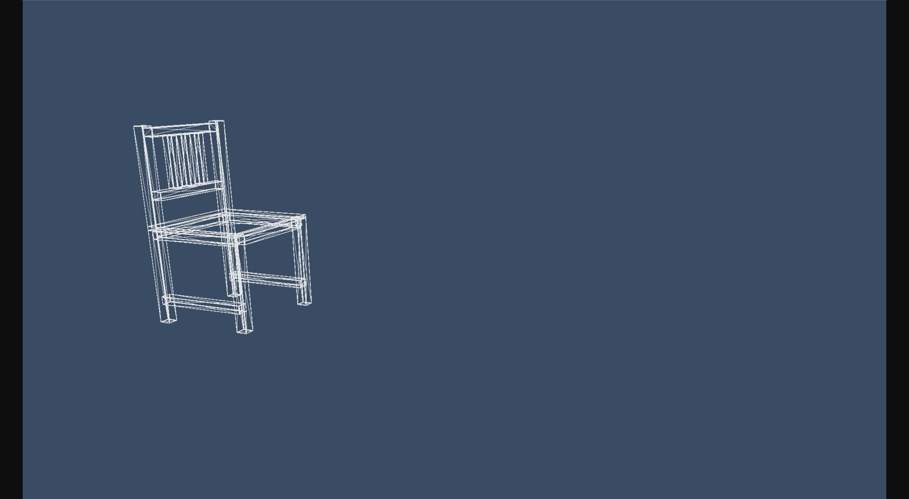
*Translation along -x and +y using the A and W keys.*

### Step 5 — Translation upwards (W key)

The W key, alone, raises the chair along the positive y-axis, while the S key lowers the chair along the negative y-axis. This is done using perspective projection in this scene, which causes the chair to appear smaller when translated away from the center.

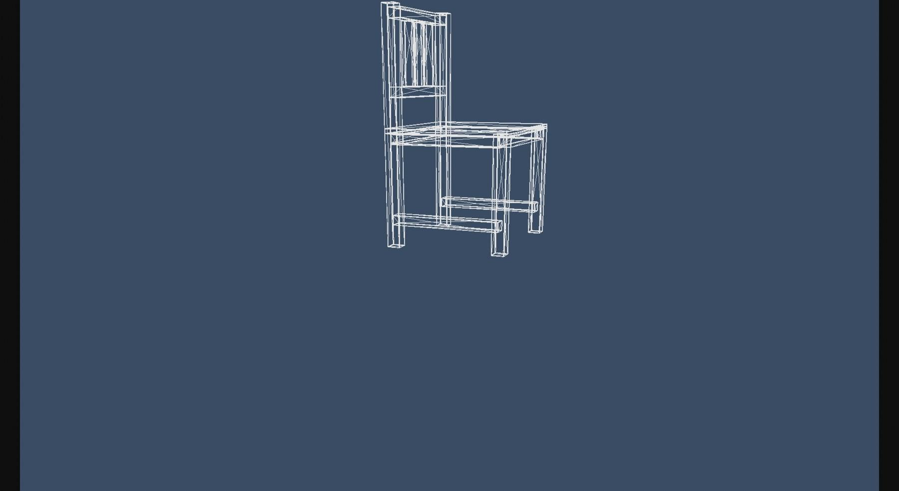
*Translation in +y direction via W.*

### Step 6 — Translation downwards (S key)

The S key translates the chair back in the opposite direction (negative y). In conjunction with previous images, all translations are covered.

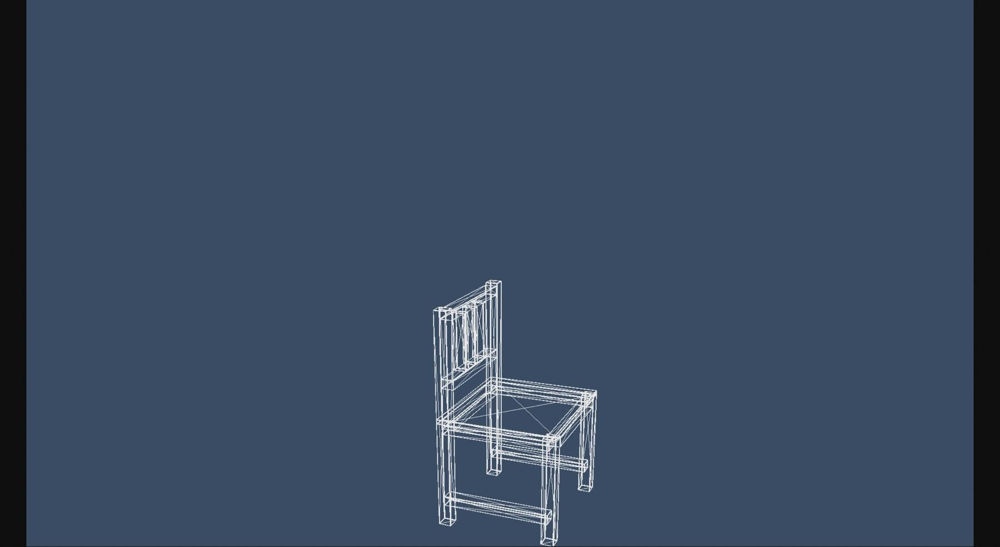
*Translation in -y direction via S.*

### Step 7 — Rotation about the z axis (E key)

Rotations occur along the z axis in steps of 30 degrees: Q rotates anti-clockwise while E rotates clockwise. Rotation differs from translation in that it requires edge detection because otherwise just one tap will lead to many rotations per frame. This ensures that precisely one step occurs for each press of the button. The angle is also wrapped around so it always stays between 0 and 360.

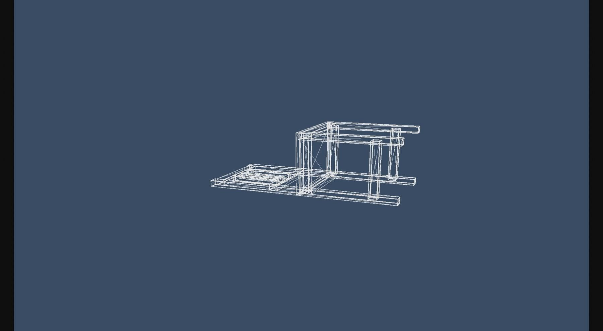
*The chair was rotated clockwise along the z axis by pressing the E key.*

### Step 8 — Rotation continued: staying in place

The model needs to be able to turn while staying put on the screen. This is achieved through the order in which the model matrix is constructed: **translate × rotate × scale ×** translate(-centre). The last translation puts the centre of the chair at the origin of the coordinate system, making the rotation happen about the chair's centre as opposed to rotation about the world origin.

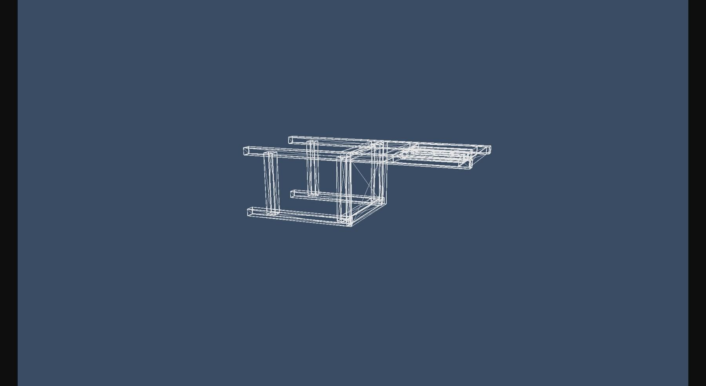
*Rotation around the z axis - the chair turns around its own centre. Q is used to reverse the direction.*

### Step 9 — Scaling along the z axis (R key)

Scaling occurs only along the z axis: R increases the scale with a multiplication by 1.1, while F decreases it by a division by the same amount. Since the export of the model from Blender uses the y axis as its height, the z axis is horizontal, stretching it will increase the depth of the chair as shown here in the elongated seat and side rails. Just like rotation, scaling uses edge detection to produce exactly one scaling step per key press.

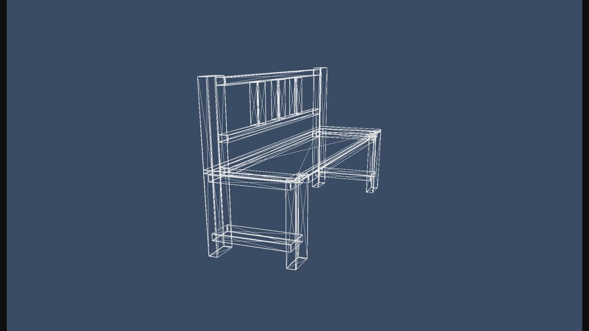
*The chair is stretched along the z axis with R.*

### Step 10 — Scaling back down (F key)

F divides the z scale with the same 1.1, thus returning the chair to its normal shape. As the R and F keys apply multiplication and division respectively with the same constant, their effect is perfectly balanced out and reversing F exactly cancels the effect of R after the same number of key presses. Since the scaling is done inside the rotation transformation in the model matrix, both operations can occur simultaneously.

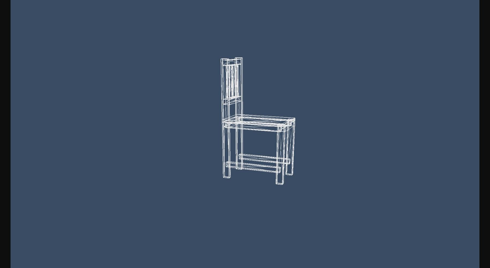
*The chair shrank back down the z axis using the F key.*
